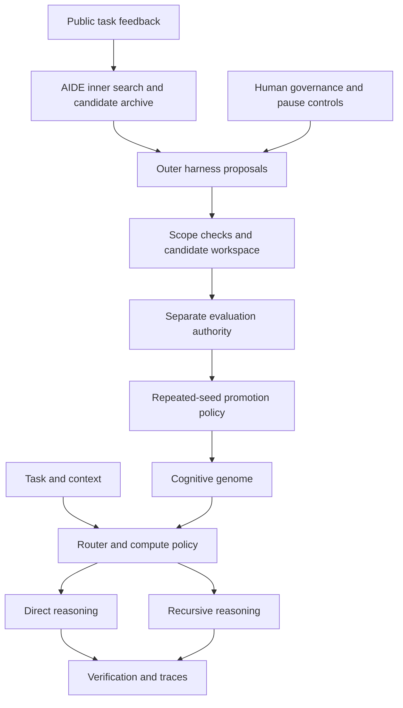

# FORGE-RLM

**An open research harness for recursive language models and AIDE-inspired agent optimization.**

[](https://github.com/ItsUkrainianCat/FORGE-RLM/actions/workflows/ci.yml)
[](LICENSE)

FORGE asks a measurable question: **can a better reasoning harness improve an open model under the same research budget, and does that improvement transfer to unseen tasks?**

The v0.4.0 research scaffold combines a configurable cognitive genome, direct and recursive reasoning, verification, candidate lineage, and controlled harness search. It is inspired by AIDE; it is not an official AIDE implementation or an affiliated project.

## Current status

**Experimental research scaffold. No measured model capability gains are published.** Offline unit tests and a deterministic toy dry-run exercise mechanisms; their synthetic scores are not benchmark results. Live Featherless inference, end-to-end RLM/GEPA optimization, a deployed sealed evaluator, and real autonomous improvement remain unverified. Sponsorship and research outcomes are not guaranteed.

| Area | Present in this repository | Evidence boundary |
| --- | --- | --- |
| Runtime | DSPy direct/RLM adapters, routing and verification | Requires a compatible model endpoint; no live inference result published |
| AIDE mechanics | Candidate trees, strategy allocation, budget objects, repeated-seed promotion, pause controls | Unit tests and synthetic dry-run; no real capability improvement demonstrated |
| Evaluation | Public sample datasets, grading interfaces and receipt checks | `forge eval` validates datasets only; sealed evaluator client is not a deployed service |
| Isolation | Git worktree manager and path scope policy | Worktrees separate files; they are not a security sandbox |
| Memory and optimization | Provenance structures, optional RuVector/RVF adapters, GEPA integration code | Native backend integrations and real optimization runs are unverified |

See [validation](docs/VALIDATION_REPORT.md), [results](docs/RESULTS.md), and [roadmap](ROADMAP.md).

## Reproduce the offline checks

Use Python **3.12 or 3.13**, Git, and [uv](https://docs.astral.sh/uv/getting-started/installation/). Run commands from the repository root; configuration and prompt paths are relative to it.

```bash
git clone https://github.com/ItsUkrainianCat/FORGE-RLM.git
cd FORGE-RLM
uv sync --frozen --extra dev --python 3.12
cp .env.example .env
uv run --frozen pytest
uv run --frozen ruff check forge tests scripts
uv run --frozen ruff format --check forge tests scripts
uv run --frozen forge doctor
uv run --frozen forge aide validate
uv run --frozen forge aide dry-run --steps 5
uv run --frozen forge eval --split regression
```

These checks do not need an API key, GPU, or paid inference. `doctor` displays configuration, not endpoint health. The dry-run uses predetermined toy mutations and grades. Sample datasets are public fixtures, not a hidden benchmark.

## Run a model-backed request

Configure `FORGE_MODEL_ID`, `FORGE_API_BASE`, and `FORGE_API_KEY` in `.env` for an OpenAI-compatible endpoint, then:

```bash
uv run --frozen forge run 'Explain this function' --context 'def add(a, b): return a + b'
```

This sends data to your configured provider and can incur inference charges. The runtime constructs the experimental DSPy RLM adapter; recursive execution may also require Deno/Pyodide. Audit that environment before a long run. Hosted model IDs containing an owner/name slash need an explicit `openai/` provider prefix, as documented in [Featherless setup](docs/FEATHERLESS.md). No specific Qwen checkpoint availability is assumed.

## Architecture



The diagram describes intended composition; not every boundary is deployed. Evaluator secrets, promotion policy, permissions, and pause controls must stay outside autonomous mutation. Read [architecture](docs/ARCHITECTURE.md) and [security](SECURITY.md) before running generated code.

| Path | Purpose |
| --- | --- |
| `forge/runtime`, `forge/rlm`, `forge/routing` | Model-backed inference and routing |
| `forge/aide`, `forge/genome` | Search, lineage, genome configuration and promotion |
| `forge/evaluation`, `evals` | Grading interfaces and public fixtures |
| `config`, `prompts` | Research policies and prompt assets |
| `tests` | Offline regression tests |
| `docs` | Protocols, design notes and integration guides |
| `.claude` | Optional engineering agent assets; not required for offline checks |

## Sponsorship proposal

The proposed Featherless pilot would fund controlled inference experiments: establish raw-model and DSPy-direct baselines, compare RLM and verification ablations, then evaluate a narrowly scoped harness mutation with equal budgets and a separate holdout. Planned deliverables include reproducible configurations, experiment lineage, cost/latency accounting, and a report including negative results. See [the pilot plan](docs/FEATHERLESS.md).

No sponsorship has been awarded or implied. No ASI, global SOTA, or guaranteed success claim is made. Publish a claim only with its dataset version, model ID, seeds, budget, and reproducible evidence.

## Contributing and license

See [CONTRIBUTING.md](CONTRIBUTING.md), [CODE_OF_CONDUCT.md](CODE_OF_CONDUCT.md), [SECURITY.md](SECURITY.md), and [CHANGELOG.md](CHANGELOG.md). Project code is MIT licensed; third-party models, data, and services retain their own licenses and terms.
